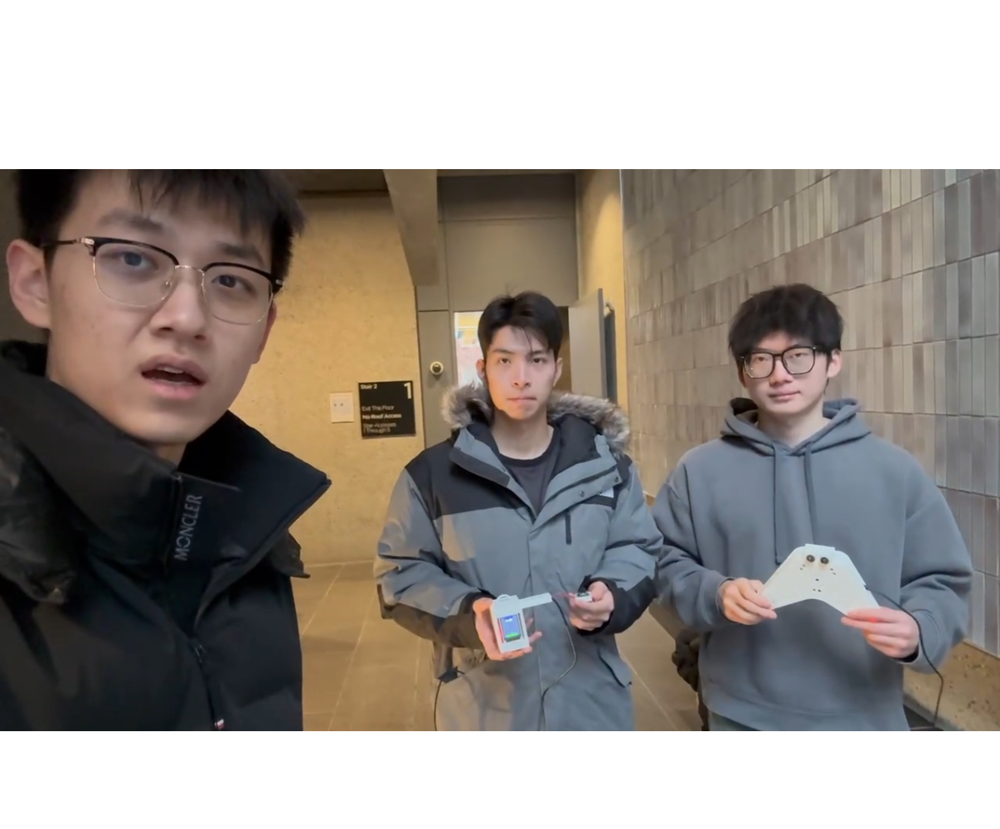
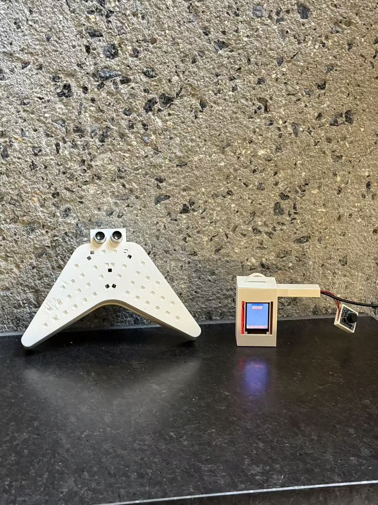
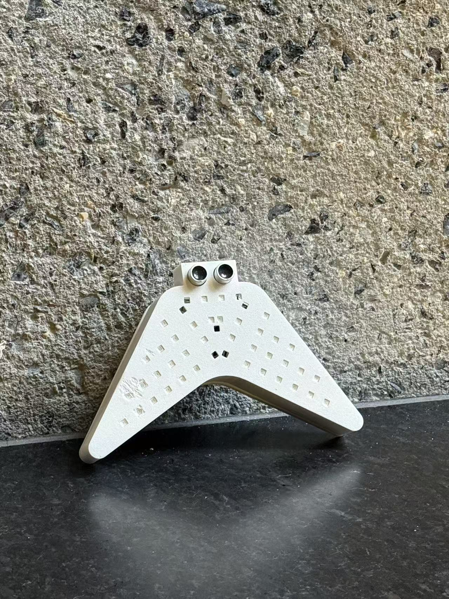
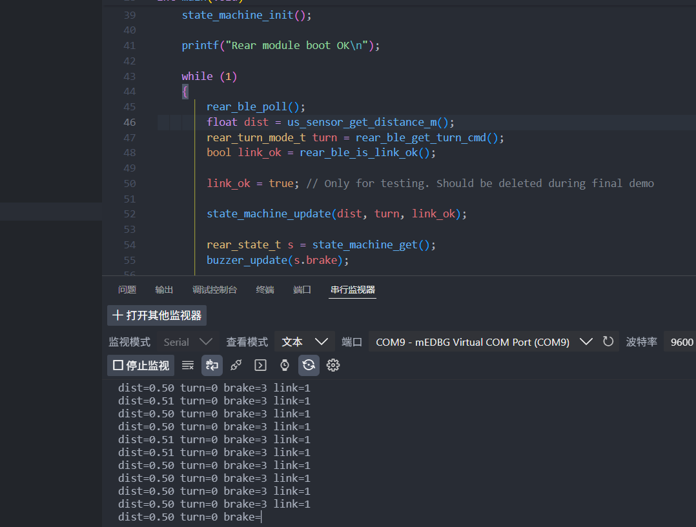
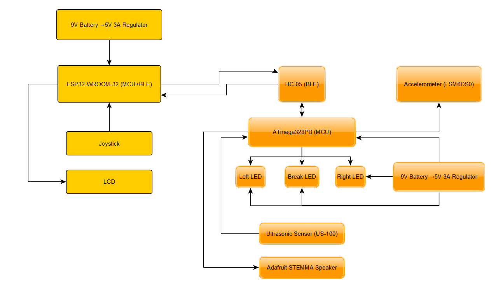

# ESE 5190 Final Project

**Team Number:** T7

**Team Name:** VeloGuard

| Team Member Name | Email Address          |
| ---------------- | ---------------------- |
| Jiaan Zhang      | jiaanz7@seas.upenn.edu |
| Tiancheng Pu     | ptc1018@seas.upenn.edu |
| Zibo Zhao        | zhao226@seas.upenn.edu |

**GitHub Repository URL:** [https://github.com/upenn-embedded/final-project-f25-f25_final_project_t7_veloguard](https://github.com/upenn-embedded/final-project-f25-f25_final_project_t7_veloguard)

**GitHub Pages Website URL:** [F25 - T7 - VeloGuard](https://upenn-embedded.github.io/final-project-website-submission-f25-t07-f25-veloguard/)

## 1. Project Overview & Video

**VeloGuard** is a smart, wireless bicycle safety system designed to enhance rider visibility and road safety. Comprising a handlebar control unit and a rear signal module linked via Bluetooth (BLE), the system features intuitive  **turn signals** , an automatic **brake light** triggered by deceleration, and a **proximity alarm** that warns riders of approaching vehicles using ultrasonic sensing. Housed in custom 3D-printed enclosures, VeloGuard demonstrates a complete end-to-end embedded system integration, combining real-time sensor processing with robust wireless communication.

*(Click the image above to watch the full demo on Google Drive)*

## 2. Images

## 3. Result

Our final system is a two-module smart bicycle lighting kit.

The front handlebar unit is based on an ESP32-WROOM dev board with a joystick and LCD: the joystick selects left/right, and the ESP32 sends single-character commands over Bluetooth to the rear unit while also receiving basic data for on-screen status.

The rear module uses an ATmega328PB to drive three LED functions (left/right turn, brake), a buzzer, an ultrasonic distance sensor, and an IMU for deceleration-based brake triggering. A timer-based state machine reads the turn-signal commands, the ultrasonic distance, and the IMU deceleration, then decides whether the rear light should stay idle, show a steady brake light, flash in a warning or burst pattern.

Because many of the original BOM parts did not arrive on time, we substituted all parts to lab-available components, but we kept the behavior of the SRS/HRS as close to the original specification as possible. In practice, we successfully assembled all of the hardware and integrated every component into our 3D-printed front and rear models. We were able to demonstrate reliable turn-signal control, ultrasonic-triggered warning and burst modes, BLE link-loss safety behavior, and basic IMU-based brake detection during short walk tests.

#### 3.1 Software Requirements Specification (SRS) Results

Overall we achieved most of the originally defined SRS requirements, with a few intentional changes. We partially met SRS-07; in our final result, the front end only displays the acceleration returned by the accelerometer and does not calculate the velocity, because the LSM6DS0 acceleration remained noisy and our simple integration is not able to give a stable real-time speed estimate in the time available.

In addition to meeting the basic turn-signal behavior in SRS-01, we also added a sequential "flowing" animation for the rear turn panels. Instead of blinking all 15 LEDs on a side at once, the firmware groups the WS2812B pixels into six rows and lights them in order while the turn signal is active. This creates a clear sweeping motion in the direction of the turn, making the rider’s intent more obvious to following drivers, similar to modern automotive sequential turn indicators.

| ID               | Requirement Description                                                                                                                                      | Validation Method & Proof of Work                                                                                                                                                                                                                                                                                           |
| :--------------- | :----------------------------------------------------------------------------------------------------------------------------------------------------------- | :-------------------------------------------------------------------------------------------------------------------------------------------------------------------------------------------------------------------------------------------------------------------------------------------------------------------------- |
| **SRS-01** | **Turn Signal Animation:** The system shall illuminate the LED panel with a sequential "flowing" effect (column-by-column) to indicate turn direction. | **Validated.** Instead of a simple blink, we implemented and verified a **sequential animation** where the 15-LED array lights up progressively from one side to the other. Visual inspection confirmed the animation direction matches the joystick input.                                                     |
| **SRS-04** | **Proximity Alert Logic:** The system shall trigger distinct warning (buzzer/flash) and alert (burst/strobe) modes based on proximity thresholds.      | **Validated (with Tuning).** While originally designed for 2.5m/1.5m, we adjusted thresholds to **1.0m (Warning)** and **0.5m (Critical)** for reliable indoor bench testing. We verified that the buzzer frequency and LED strobe intensity increased correctly as objects crossed these new thresholds. |
| **SRS-05** | **Sensor Update Rate:** Ultrasonic ranging shall operate at an update rate ≥ 10 Hz to ensure real-time safety.                                        | **Validated.** We logged the ultrasonic sensor timestamps via UART. Analysis of the logs confirmed the distance measurements are updated and processed at **≥ 10 Hz** (latency <100ms), meeting real-time requirements.                                                                                        |
| **SRS-06** | **Link-Loss Safety:** Both Front and Rear modules shall detect BLE connection loss (> 1.0s) and enter safe states.                                     | **Validated.** We powered down one module to simulate signal loss. **Both modules** successfully detected the timeout: the Front unit updated the LCD status to "Link Loss", and the Rear unit automatically engaged the "Warning Flash" failsafe pattern to ensure visibility.                                 |

#### 3.2 Hardware Requirements Specification (HRS) Results

On the hardware side, most HRS items were satisfied with the substituted components, but a few were only partially validated. Because the LM2596 buck module didn't arrive, we did not perform a full battery-powered stress test for  HRS-01 (5 V rail ≥4.8 V under all loads) ;  instead we powered the system from USB supply and made sure the system voltage is stable enough to meet the requirements when both turn panels, the brake LED, the buzzer, and sensors were active.

We also reserved space for a 9V battery; if the buck module is available, the entire system can switch to be powered from the battery. For HRS-03 (IMU interface reliability) we were able to read LSM6DS0 data over I²C at the desired rate, but the noise level made accurate real-time speed estimation difficult. BLE range (HRS-04), ultrasonic ECHO quality (HRS-02), and fail-safe brake behavior (HRS-05) all behaved as specified in indoor tests. In addition, we optimized the rear-end wiring layout to increase the system's level of integration, allowing all functions to be implemented within a small enclosure.

| ID               | Requirement Description                                                                                                          | Validation Method & Proof of Work                                                                                                                                                                                                                                                  |
| :--------------- | :------------------------------------------------------------------------------------------------------------------------------- | :--------------------------------------------------------------------------------------------------------------------------------------------------------------------------------------------------------------------------------------------------------------------------------- |
| **HRS-01** | **Power Integrity:** Under full system load (Flowing LEDs + Buzzer + RF + Sensors), the 5V rail shall not drop below 4.8V. | **Validated.** We fully activated the sequential LED animation, buzzer, and sensors simultaneously. Using a multimeter, we confirmed the VCC rail remained stable between **4.92 V and 5.00 V**, proving the power distribution network handles peak dynamic currents. |
| **HRS-02** | **Ultrasonic Accuracy:** The US-100 sensor shall accurately detect obstacles from 0.2 m to 3.0 m with stable ECHO pulses.  | **Validated.** We placed fixed objects at calibrated distances and compared the sensor output against a tape measure. The hardware consistently produced stable ECHO pulses corresponding to the correct distances, even at the adjusted 0.5m/1.0m test points.              |
| **HRS-04** | **BLE Connectivity:** The BLE link shall maintain a stable UART connection between Front and Rear modules.                 | **Validated.** We performed walk-tests verifying that the handlebar unit and rear unit maintained bidirectional communication (commands sent, status received) at distances exceeding the length of a standard bicycle.                                                      |
| **HRS-08** | **Mechanical Integration:** All rear electronics must fit within the custom 3D-printed enclosure.                          | **Validated.** We successfully assembled the ATmega328PB board, LED panels, and sensors into the final enclosure. The fit was verified physically; the case closed securely with no strain on the wiring harness.                                                            |

### 3.3 Video & Images of Test Results

## 4. Conclusion

This project represented our team's first successful deployment of a comprehensive embedded system, integrating wireless communication, real-time sensing, and custom mechanical design. Despite facing significant supply chain delays that necessitated major hardware substitutions, we successfully adapted our firmware architecture to deliver a functional prototype featuring reliable turn signals, ultrasonic proximity alerts, and fail-safe mechanisms. While challenges with accelerometer noise limited the precision of our speed tracking feature, the project validated the robustness of our state-machine control logic and enclosure design.

Moving forward, we aim to refine our sensor filtering algorithms and transition to a fully ruggedized, battery-powered hardware solution for real-world deployment.

# Appendix: Final Project Proposal

### 1. Abstract

Our project, **Smart Bike Light**, is a two-part wireless lighting and safety system for cyclists.
The **front handlebar module** includes two buttons that transmit left and right turn signals via Bluetooth to the **rear signal module**.
The rear module controls LED light boards for turn indicators, a brake light, and a buzzer alarm.
It also integrates an ultrasonic distance sensor to detect vehicles approaching from behind and automatically triggers flashing and sound alerts when the distance becomes unsafe.
This system demonstrates real-time embedded control, wireless communication, and sensor-based safety feedback to improve cycling visibility and road safety.

### 2. Motivation

Cyclists often ride in low-visibility environments where hand signals and basic tail lights are not enough to ensure safety.
Our project aims to solve this problem by creating an intelligent, responsive lighting system that improves communication between cyclists and surrounding vehicles.
By combining Bluetooth wireless control, distance sensing, and PWM-based light modulation, the Smart Bike Light allows riders to signal turns more clearly and receive automatic warnings when another vehicle gets too close.
The purpose of this project is to enhance night-riding safety, demonstrate real-time control using embedded systems, and provide a low-cost, easily installable upgrade for everyday bicycles.

### 3. System Block Diagram

### 4. Design Sketches

This project needs 3D printing to achieve the vision looks like the sketches and some function, such as being connected and fixed to the bicycle frame or seat.

### 5. Software Requirements Specification (SRS)

**5.1 Definitions, Abbreviations**

Here, you will define any special terms, acronyms, or abbreviations you plan to use for hardware

| Term             | Meaning                                                                          |
| ---------------- | -------------------------------------------------------------------------------- |
| Left/Right mode  | Only the corresponding side LED panel blinks.                                    |
| Both-sides mode  | Left and right panels blink together (hazard).                                   |
| Brake steady     | Center brake LED stays ON continuously.                                          |
| Warning flash    | Brake LED flashes at**4–6 Hz** (attention).                               |
| Burst strobe     | Brake LED flashes at**8–12 Hz** (high urgency).                           |
| D_warn           | Proximity warning threshold =**2.5 m**.                                    |
| D_alert          | Proximity alert threshold =**1.5 m**.                                      |
| a_warn / a_alert | Deceleration thresholds:**0.8 m/s²** (warn), **1.5 m/s²** (alert). |
| Link loss        | No valid BLE packet for**≥ 1.0 s**.                                             |

**5.2 Functionality**

| ID               | Requirement Description                                                                                                                                                                                                                                                                                         | Validation Method                                                                                                                       |
| ---------------- | --------------------------------------------------------------------------------------------------------------------------------------------------------------------------------------------------------------------------------------------------------------------------------------------------------------- | --------------------------------------------------------------------------------------------------------------------------------------- |
| **SRS-01** | The front buttons**shall** command light modes: pressing **Left** or **Right** **shall** make only that side blink at **4–6 Hz**; pressing both **shall** make both sides blink at **4–6 Hz**. LEDs **shall** run at **maximum brightness** by default. | Record ≥60 fps video while pressing buttons; count frames to verify 4–6 Hz and correct side(s); confirm command receipt in rear logs. |
| **SRS-02** | With a speed sensor installed, when speed is**0** or longitudinal deceleration is **≥ 0.5 m/s²**, the brake LED **shall** turn **steady ON** and remain ON while the condition holds.                                                                                                 | Use roller/hand-push; log speed/accel and brake state; verify steady ON during `v = 0` or `a ≤ −0.5`.                             |
| **SRS-03** | If filtered distance is within**(1.5 m, 2.5 m]***or* deceleration is **≥ 0.8 m/s²**, the brake LED **shall** enter **warning flash** at **4–6 Hz** and **shall** exit only when distance is **> 2.5 m** and the condition clears for **≥ 0.5 s**.               | Mark 1–5 m; move target; record distance log and video; check frequency and hysteresis timing.                                         |
| **SRS-04** | If distance is**≤ 1.5 m***or* deceleration is **≥ 1.5 m/s²**, the brake LED **shall** enter **burst strobe** at **8–12 Hz** and the buzzer **shall** beep in **1:1 sync** with the flashes.                                                                           | Approach to ≤1.5 m and perform a hard brake; capture audio + video; confirm 8–12 Hz and 1:1 beep/flash sync.                          |
| **SRS-05** | Ultrasonic ranging**shall** operate over **0.2–5.0 m** at **≥ 10 Hz** update rate with error **≤ ±10 %** in the **0.5–3.0 m** region.                                                                                                                                        | Place reflectors at known distances; log at ≥10 Hz; compute error statistics vs. ground truth.                                         |
| **SRS-06** | On BLE link loss for**≥ 1.0 s**, the system**shall** hold **warning flash** (4–6 Hz) on the brake LED and **shall** ignore turn commands until the link recovers.                                                                                                                           | Power-cycle or shield BLE; verify warning flash persists and commands are ignored; confirm automatic recovery.                          |
| **SRS-07** | The LCD**shall** display **current speed** updated **≥ 5 Hz** and **shall** show the active mode text (`Left/Right/Both/Brake/Warning/Burst/Link-Loss`).                                                                                                                             | Feed a known speed profile (roller or simulated pulses); measure update interval; verify mode text matches actual state.                |
| **SRS-08** | The buzzer**shall** be active **only** during **burst strobe** and **shall not** sound in other modes unless a configuration flag enables it.                                                                                                                                           | Cycle through all modes; confirm buzzer sounds only in burst; toggle the config flag and re-test.                                       |

### 6. Hardware Requirements Specification (HRS)

*Formulate key hardware requirements here. Think deeply on the design: What must your device do? How will you measure this during validation testing? Create 4 to 8 critical system requirements.*

*These must be testable! See the Final Project Manual Appendix for details. Refer to the table below; replace these examples with your own.*

**6.1 Definitions, Abbreviations**

| Term                | Meaning                                           |
| ------------------- | ------------------------------------------------- |
| **MCU**       | ATmega328PB (Rear) / ESP32-C3 (Front)             |
| **BLE**       | Bluetooth Low Energy link via HM-10 (UART bridge) |
| **US Sensor** | Ultrasonic sensor (US-100 / HC-SR04, TRIG + ECHO) |
| **LCD**       | Status display on front module                    |

**6.2 Functionality**

| ID                                           | Hardware Requirement                                                                                                                                                                                               | Validation Method                                                                                  |
| -------------------------------------------- | ------------------------------------------------------------------------------------------------------------------------------------------------------------------------------------------------------------------ | -------------------------------------------------------------------------------------------------- |
| HRS-01 (Power Integrity)                     | The system shall be powered by a regulated 5 V rail on both modules. With all loads active (LEDs + buzzer + sensors + MCU), the voltage shall not drop below 4.8 V .                                              | Measure Vout using oscilloscope under full-load stress (turn signals 2 Hz + brake on + buzzer on). |
| HRS-02 (Ultrasonic Sensor Performance)       | The US sensor shall detect obstacles from 0.2 m to ≥ 3.0 m , and produce a clean5 V TTL ECHO pulsemeasurable by the MCU timer.                                                                                    | Place objects at known distances (0.2/1/2/3 m); confirm Echo pulse width and measurement error.    |
| HRS-03 (Accelerometer Interface Reliability) | The LSM6DS3 shall provide stable acceleration data via I²C at ≥ 100k Hz , with signal noise not preventing braking detection.                                                                                   | Poll and log ACC output for 10 s; confirm ≥ 100k samples/sec and stable noise band.              |
| HRS-04 (BLE Link Budget & Range)             | The BLE link via HM-10 shall maintain a stable UART connection over ≥ 2 m indoor line-of-sight withpacket error rate < 1% .                                                                                      | Perform BLE distance walk test; compare Rx vs. Tx byte counts in UART log.                         |
| HRS-05 (Fail-Safe Hardware Behavior)         | When BLE link is lost, or when the MCU resets/browns-out, the rear system hardware shall ensurethe Brake LED defaults ON(via pull-up or safe-bias), providing continuous visibility even before firmware recovers. | Power-cycle BLE / press reset / induce brown-out; visually confirm Brake LED stays on.             |
| HRS-06 (Buzzer Output)                       | The buzzer drive stage shall deliver ≥60 dB SPL at 30 cm when activated, and be fully switch-controllable by the MCU (no audible leakage in idle).                                                                | Measure SPL using phone app at 30 cm; verify silence in idle via oscilloscope.                     |
| HRS-07 (Front LCD Interface)                 | The LCD interface shall support ≥ 5 Hz refresh without causing missed BLE packets or sensor sampling on the front MCU.                                                                                            | Run refresh test; confirm stable BLE log + LCD updates with stopwatch timing.                      |

### 7. Bill of Materials (BOM)

Google Sheet for BOM link: [BOM for Team7 VeloGuard](https://docs.google.com/spreadsheets/d/1bHwMPB5nC805xI1gRusFQk9g4mlo7jpOiUuIshi9kqY/edit?usp=sharing)
